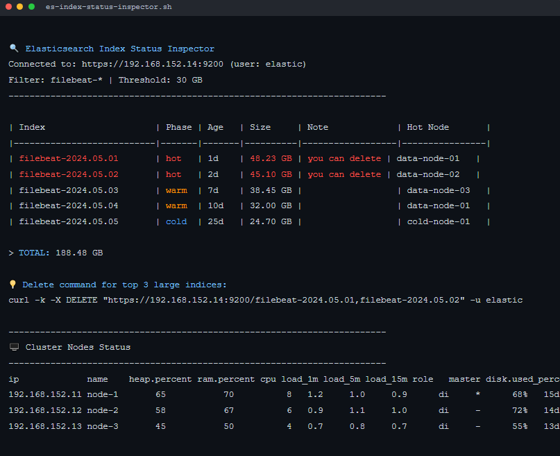

# Elasticsearch-index-status-inspector
A Bash script to monitor Elasticsearch indices: ILM phase, size, age, node location, and deletion suggestions.
______________________________________________________________________________________________________________


# 🛠️ Elasticsearch-index-status-inspector


A powerful **Bash script** to monitor and manage your **Elasticsearch indices** — with live insights into **ILM phase**, **size**, **age**, **node distribution**, and **deletion recommendations**.

Perfect for DevOps, SREs, and Elastic Stack admins who need a quick terminal dashboard for index lifecycle management.



---

## ✨ Features

- 🔍 **Index filtering** by Beat type (`filebeat`, `winlogbeat`, etc.) or custom keyword
- 🌡️ **Color-coded ILM phases** (Hot 🟥, Warm 🟠, Cold 🔵)
- 📏 **Size in GB** with threshold-based deletion alerts
- 💻 **Hot node mapping** — see which nodes host each index
- ⏳ **Age tracking** — how old is each index?
- 🗑️ **Smart delete suggestions** for oversized indices
- 🖥️ **Cluster node status table** with alternating row colors
- 🔐 Supports **HTTPS + Basic Auth** (Elastic user/pass)

---

## 🚀 Quick Start

```bash
git clone https://github.com/alibeigi-amir/Elasticsearch-index-status-inspector.git
cd Elasticsearch-index-status-inspector
chmod +x es-index-status-inspector.sh
./es-index-status-inspector.sh
```


You'll be prompted for:

Elasticsearch IP (default: 192.168.152.14)
Username (default: elastic)
Password
Index prefix or custom keyword
Size threshold (GB) for deletion warning
---------------
🧩 Supported Index Types
Choose from:

filebeat-*
winlogbeat-*
metricbeat-*
packetbeat-*
auditbeat-*
heartbeat-*
Custom keyword search
All indices (*)
---------------
🖥️ Cluster Node Status
Colorful, readable table showing:

IP, Node Name
Heap, RAM, CPU usage
Load averages
Disk usage
Uptime
---------------
📄 License
MIT License — feel free to use, modify, and share.
---------------
🤝 Contributions
Welcome! Open an issue or PR for new features (e.g., Kibana integration, JSON output, Slack alerts).


